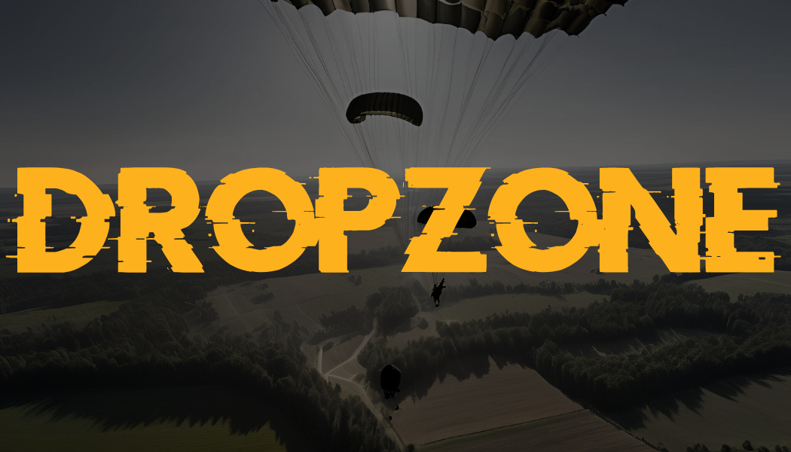
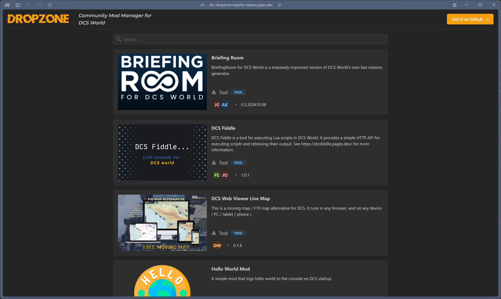
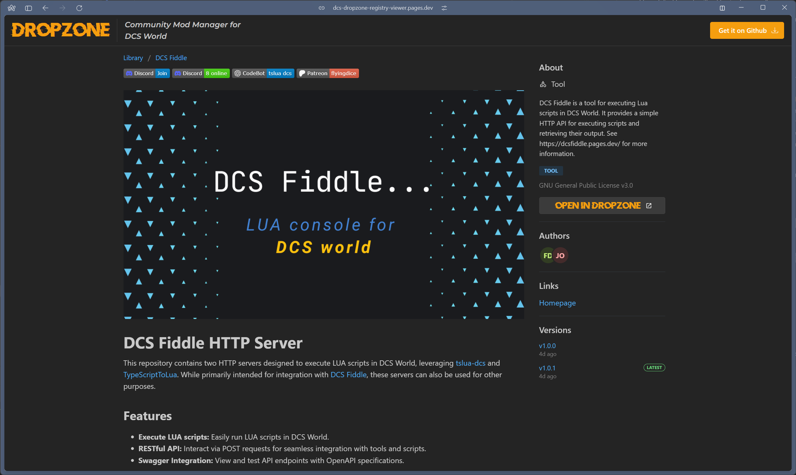

**DROPZONE: The Community Mod Manager for DCS World**

DROPZONE simplifies managing mods for DCS World, pulling its curated mod list directly from the [DCS Mod Manager Registry](https://github.com/flying-dice/dcs-mod-manager-registry).

Mod installation is managed by DROPZONE, it will download, unpack, and symlink mods into your DCS World directories. This allows you to easily enable and disable mods without having to manually manage files.

To suggest a mod or contribute, create an issue or submit a pull request on the registry's GitHub repository.

### Key Features

- [x] **Initial Release**: The first version of DROPZONE is now available for download with support for mod subscribing, downloading, unpacking, enabling, and disabling.
- [x] **Mod Library**: Browse and search for mods in the Library, and subscribe to mods to add them to your collection improving discoverability of mods.
- [ ] **Mod Popularity**: Implement a system to track and display the popularity of mods based on the number of subscribers and downloads.
- [ ] **Mod Ratings**: Allow users to rate mods and provide feedback to mod creators.
- [ ] **Mod Comments**: Enable users to leave comments on mods to provide feedback, suggestions and help other users.
- [ ] **Mod Update Improvements**: Enhance the mod update process to make it more intuitive to transition to the latest version.
- [ ] **MissionScripting.lua Support**: Integrate support for managing MissionScripting.lua file and historical versions to prevent DCS updates from breaking mods that rely on this file being modified.
- [ ] **MissionScripting Requirements**: Implement a system to manage the requirements for MissionScripting.lua files, ensuring that the user has the necessary modifications in place to allow mods to function correctly.

## Installation

This Repository is for the DROPZONE Library Viewer (Web Application)

Visit the Site https://dcs-dropzone-registry-viewer.pages.dev/

To install the DROPZONE application, visit the dedicated repository for the [DROPZONE Application](https://github.com/flying-dice/dcs-dropzone-mod-manager)

## Usage

Visit the Site https://dcs-dropzone-registry-viewer.pages.dev/

Browse the library of mods, search for mods, and open any mod by clicking on the title to view more details.

From the mod details page, if you have the DROPZONE application installed, you can click the `Open in DROPZONE` button to take you direct to the mod page.

## Badges

If you would like to help users to install their mods via DROPZONE, you can use the following badges in your projects.

## Development

See the [CONTRIBUTNG.md](CONTRIBUTNG.md) for more information on how to contribute.
